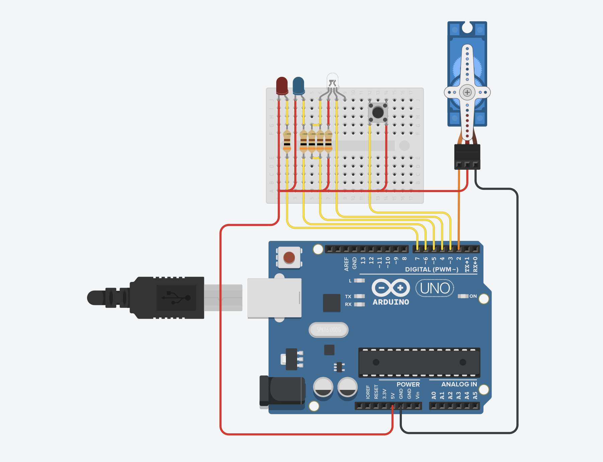
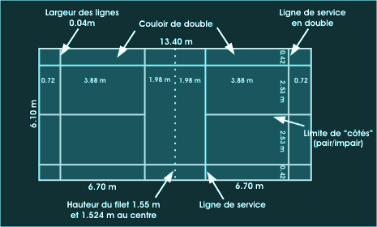

# Lanceur de volant de badminton automatisé

Projet de TIPE : modélisation d'une assistance mécanique pour l'entraînement au badminton, combinant détection du joueur par vision par ordinateur et pilotage d'un lanceur motorisé.

*English summary: Automated badminton shuttlecock launcher developed as an engineering project (TIPE). It uses stereo computer vision (Python / OpenCV) to track a player's 2D position on the court via triangulation (depth and azimuth) and controls an Arduino-based motorized launcher over serial communication.*

---

## Principe de fonctionnement

L'objectif du projet est de localiser un joueur en temps réel sur un demi-terrain de badminton afin d'orienter automatiquement un lanceur de volants selon différents modes d'entraînement.

Le système repose sur quatre briques :
1. **Détection du joueur (OpenCV)** : Après un premier prototypage avec YOLO, la détection temps réel est assurée par un filtrage colorimétrique dans l'espace HSV suivi d'un seuillage binaire et d'une extraction du contour principal.
2. **Localisation par stéréovision** : Deux caméras alignées sur un même plan vertical et séparées d'une distance fixe mesurent les angles d'observation du joueur. La position (profondeur et azimut) est déduite par triangulation.
3. **Logique d'entraînement et visualisation 2D** : Affichage en temps réel de la position du joueur sur un terrain virtuel. Deux modes de visée sont implémentés : tir vers une position fixe ou tir aléatoire dans un rayon de difficulté autour du joueur pour forcer le déplacement.
4. **Commande matérielle (Arduino UNO)** : Envoi des consignes (azimut, altitude, puissance, fréquences, niveau de difficulté) par liaison série USB pour piloter les servomoteurs d'orientation et gérer le boîtier de contrôle (bouton de sélection de niveau et LEDs d'état).

Une étude balistique prenant en compte les frottements aérodynamiques du volant ($C_x \cdot S$) complète le modèle pour relier la distance de tir aux paramètres de lancement.

---

## Architecture du dépôt

```text
├── docs/
│   ├── court_dimensions.png
│   ├── launcher_demo.mp4
│   ├── presentation_tipe.pdf
│   └── user_manual.pdf
├── hardware/
│   ├── arduino_wiring.png
│   ├── bom_components.csv
│   ├── electrical_schematic.pdf
│   └── launcher_controller/
│       └── launcher_controller.ino
├── src/
│   ├── badminton_court.py
│   ├── camera_calibration.py
│   ├── color_filter_calibration.py
│   ├── image_overlay.py
│   ├── main.py
│   ├── player_detection.py
│   ├── position_variables.py
│   ├── serial_communication.py
│   └── user_interface.py
├── README.md
└── requirements.txt
```

### Code source Python (`src/`)
* `main.py` : Boucle principale d'acquisition des deux caméras, calculs géométriques, affichage de l'interface (flux vidéo + terrain 2D) et communication série.
* `player_detection.py` : Fonctions de traitement d'image (conversion BGR vers HSV, masque de couleur, seuillage et détection du rectangle englobant).
* `position_variables.py` : Calculs optiques et géométriques (distance focale, champ de vision, triangulation de la profondeur et de l'azimut, coordonnées du cercle de difficulté).
* `badminton_court.py` : Modélisation graphique du terrain de badminton aux cotes officielles et affichage des cônes de vision.
* `color_filter_calibration.py` : Script de calibration permettant de récupérer les valeurs HSV d'un pixel au clic et d'ajuster les seuils via des barres de réglage.
* `camera_calibration.py` : Outil d'aide à l'alignement physique des deux caméras.
* `serial_communication.py` : Détection des ports USB disponibles et ouverture de la connexion série avec le microcontrôleur.
* `user_interface.py` : Lecture des commandes saisies dans le terminal pour modifier les paramètres à la volée.
* `image_overlay.py` : Incrustation des données (distance, largeur, angles, azimut) sur le retour vidéo.

### Électronique et embarqué (`hardware/`)
* `launcher_controller/launcher_controller.ino` : Programme embarqué sur l'Arduino UNO assurant le décodage des trames série et l'asservissement des servomoteurs.
* `arduino_wiring.png` et `electrical_schematic.pdf` : Schémas de câblage de la partie commande et de la partie puissance.
* `bom_components.csv` : Liste des composants électroniques utilisés.

### Documentation (`docs/`)
* `presentation_tipe.pdf` : Support de présentation complet (modélisation théorique, algorithmes et courbes expérimentales).
* `user_manual.pdf` : Notice d'installation et d'utilisation du dispositif.
* `launcher_demo.mp4` : Vidéo d'un essai de tir en gymnase.
* `court_dimensions.png` : Schéma des dimensions réglementaires du terrain.

---

## Aperçu matériel

### Câblage Arduino


### Dimensions du terrain


---

## Prérequis et installation

### Logiciel
Python 3 avec les bibliothèques nécessaires (`numpy==2.2.3`, `opencv-python==4.11.0.86`, `pyserial==3.5`) :

```bash
pip install -r requirements.txt
```

### Matériel
* 2 caméras fixées sur un support rigide (orientations parallèles, écartement connu).
* 1 carte Arduino UNO connectée en USB, reliée aux servomoteurs, aux LEDs d'information et au bouton poussoir.

---

## Utilisation

1. Téléverser le fichier `hardware/launcher_controller/launcher_controller.ino` sur la carte Arduino.
2. Vérifier l'alignement des caméras avec `src/camera_calibration.py`, puis ajuster les seuils de détection de couleur selon l'éclairage ambiant avec `src/color_filter_calibration.py`.
3. Lancer le programme principal :

```bash
python src/main.py
```

### Commandes en cours d'exécution

Changement du retour vidéo (touches clavier) :
* `1` : Flux vidéo original avec cadre de détection
* `2` : Image seuillée (binaire)
* `3` : Image filtrée (masque de couleur uniquement)

Modification des paramètres (saisie dans le terminal avec préfixe + valeur entière) :
* `V` : Fréquence d'envoi des volants (en ms)
* `F` : Fréquence de mise à jour du lanceur (en ms)
* `R` : Rayon du cercle de difficulté autour du joueur (en mm)
* `P` : Profondeur de la position de tir permanent (en mm)
* `L` : Largeur de la position de tir permanent (en mm)

Le changement du niveau de difficulté (`1`, `2` ou `3`) peut également se faire depuis le bouton physique relié à l'Arduino. Pour arrêter le programme proprement, maintenir la touche `q` pendant 2 secondes.

---

## Résultats et précision des mesures

Comparaison entre les positions réelles sur le terrain et les mesures issues de la triangulation :

| Paramètre | Essai 1 | Essai 2 | Essai 3 |
| :--- | :--- | :--- | :--- |
| Distance réelle (mm) | 2730 | 5448 | 7388 |
| Distance mesurée (mm) | 2698 | 5467 | 7412 |
| Azimut réel (deg) | -10,80 | 7,98 | 24,20 |
| Azimut mesuré (deg) | -10,17 | 7,67 | 23,67 |

---

## Auteur

Aurélien Capron — [Portfolio](https://aureliencapron.github.io)