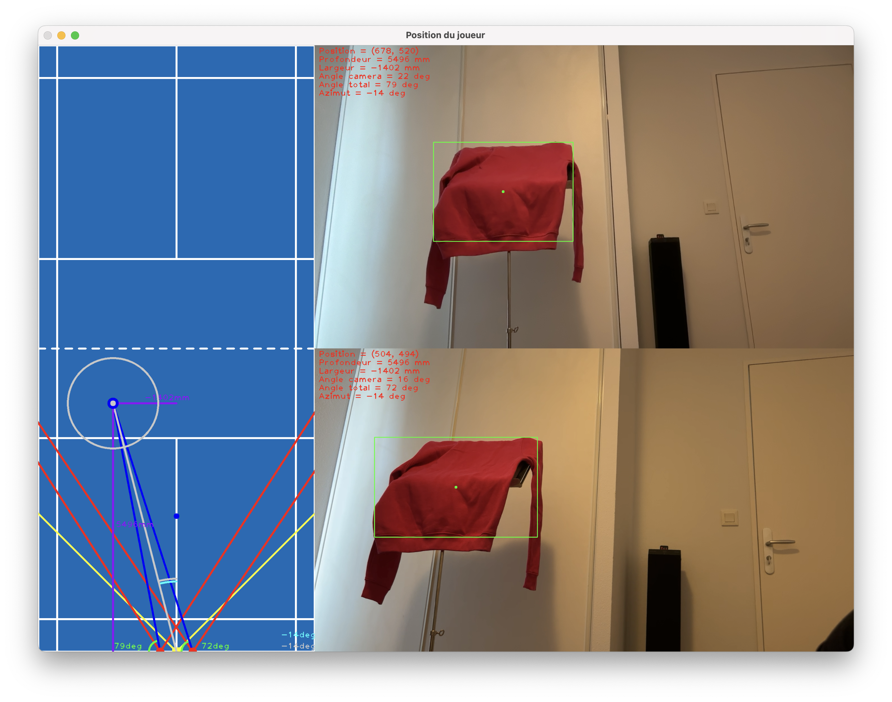
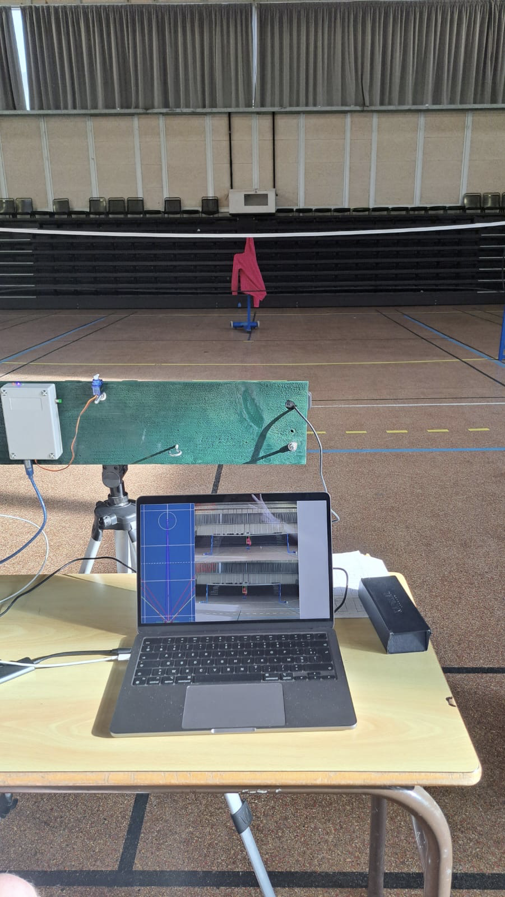

# Lanceur de volant de badminton automatisé


Projet de TIPE : modélisation d'une assistance mécanique pour l'entraînement au badminton, combinant détection du joueur par vision par ordinateur et pilotage d'un lanceur motorisé.

*English summary: Automated badminton shuttlecock launcher developed as an engineering project (TIPE). It uses stereo computer vision (Python / OpenCV) to track a player's 2D position on the court via triangulation (depth and azimuth) and controls an Arduino-based motorized launcher over serial communication.*

---

## Principe de fonctionnement

L'objectif du projet est de localiser un joueur en temps réel sur un demi-terrain de badminton afin d'orienter automatiquement un lanceur de volants selon différents modes d'entraînement.

1. **Détection du joueur (OpenCV)** : Après un premier prototypage avec YOLO, la détection temps réel est assurée par un filtrage colorimétrique dans l'espace HSV suivi d'un seuillage binaire et d'une extraction du contour principal.
2. **Localisation par stéréovision** : Deux caméras alignées sur un même plan vertical et séparées d'une distance fixe mesurent les angles d'observation du joueur. La position (profondeur et azimut) est déduite par triangulation.
3. **Logique d'entraînement et visualisation 2D** : Affichage en temps réel de la position du joueur sur un terrain virtuel (tir vers une position fixe ou tir aléatoire dans un rayon de difficulté autour du joueur).
4. **Commande matérielle (Arduino UNO)** : Envoi des consignes par liaison série USB pour piloter les servomoteurs d'orientation et gérer le boîtier de contrôle (bouton de niveau et LEDs d'état).

Une étude balistique prenant en compte les frottements aérodynamiques du volant ($C_x \cdot S$) complète le modèle pour relier la distance de tir aux paramètres de lancement.

---

## Architecture du dépôt

```text
├── docs/
│  ├── presentation_tipe.pdf         # Présentation complète (modèle théorique et courbes)
│  ├── user_manual.pdf               # Notice d'installation et d'utilisation
│  ├── launcher_demo.mp4             # Vidéo d'un essai de tir en gymnase
│  ├── software_interface.png        # Capture de l'interface logicielle (OpenCV + terrain 2D)
│  ├── experimental_setup.png        # Photo du dispositif expérimental en gymnase
│  └── court_dimensions.png          # Dimensions réglementaires du terrain
├── hardware/
│  ├── launcher_controller/
│  │  └── launcher_controller.ino   # Firmware Arduino UNO (série + servomoteurs)
│  ├── arduino_wiring.png            # Câblage de la carte Arduino
│  ├── electrical_schematic.pdf      # Schéma électrique complet
│  └── bom_components.csv            # Liste des composants électroniques
├── src/
│  ├── main.py                       # Boucle principale (caméras, interface 2D, série)
│  ├── player_detection.py           # Filtrage HSV, seuillage et détection du joueur
│  ├── position_variables.py         # Triangulation (profondeur, azimut) et géométrie
│  ├── badminton_court.py            # Modélisation graphique 2D du terrain
│  ├── color_filter_calibration.py   # Calibration interactive des seuils HSV
│  ├── camera_calibration.py         # Aide à l'alignement physique des caméras
│  ├── serial_communication.py       # Détection et connexion au port série USB
│  ├── user_interface.py             # Commandes dynamiques depuis le terminal
│  └── image_overlay.py              # Incrustation des données sur le flux vidéo
└── requirements.txt                  # Dépendances Python
```

---

## Aperçu du système

| Interface logicielle (Stéréovision & Terrain 2D) | Dispositif expérimental en gymnase |
| :---: | :---: |
|  |  |

| Câblage Arduino | Dimensions du terrain |
| :---: | :---: |
|  |  |

---

## Prérequis et utilisation

### 1. Installation
Python 3 avec les bibliothèques requises (`numpy==2.2.3`, `opencv-python==4.11.0.86`, `pyserial==3.5`) :

```bash
pip install -r requirements.txt
```

Matériel requis : 2 caméras fixées sur un support rigide (orientations parallèles, écartement connu) et 1 carte Arduino UNO connectée en USB.

### 2. Lancement
1. Téléverser `hardware/launcher_controller/launcher_controller.ino` sur la carte Arduino.
2. Vérifier l'alignement des caméras (`src/camera_calibration.py`) et calibrer le filtre de couleur (`src/color_filter_calibration.py`).
3. Exécuter le programme principal :

```bash
python src/main.py
```

### 3. Commandes en cours d'exécution
* **Affichage caméra (clavier)** : `1` (flux original), `2` (image seuillée), `3` (masque de couleur), maintenir `q` 2s (quitter).
* **Paramètres dynamiques (terminal, préfixe + entier)** : `V` (fréquence d'envoi en ms), `F` (fréquence de mise à jour en ms), `R` (rayon de difficulté en mm), `P` et `L` (profondeur et largeur du tir fixe en mm).
* **Difficulté** : Bouton poussoir sur le boîtier Arduino (`1`, `2` ou `3`).

---

## Résultats expérimentaux

Comparaison entre les positions réelles sur le terrain et les mesures issues de la triangulation :

| Paramètre | Essai 1 | Essai 2 | Essai 3 |
| :--- | :--- | :--- | :--- |
| Distance réelle (mm) | 2730 | 5448 | 7388 |
| Distance mesurée (mm) | 2698 | 5467 | 7412 |
| Azimut réel (deg) | -10,80 | 7,98 | 24,20 |
| Azimut mesuré (deg) | -10,17 | 7,67 | 23,67 |

---

## Auteur

Aurélien Capron — [Portfolio](https://aureliencapron.github.io)